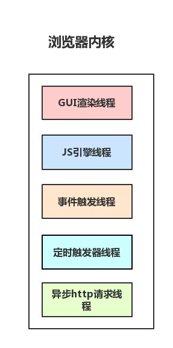
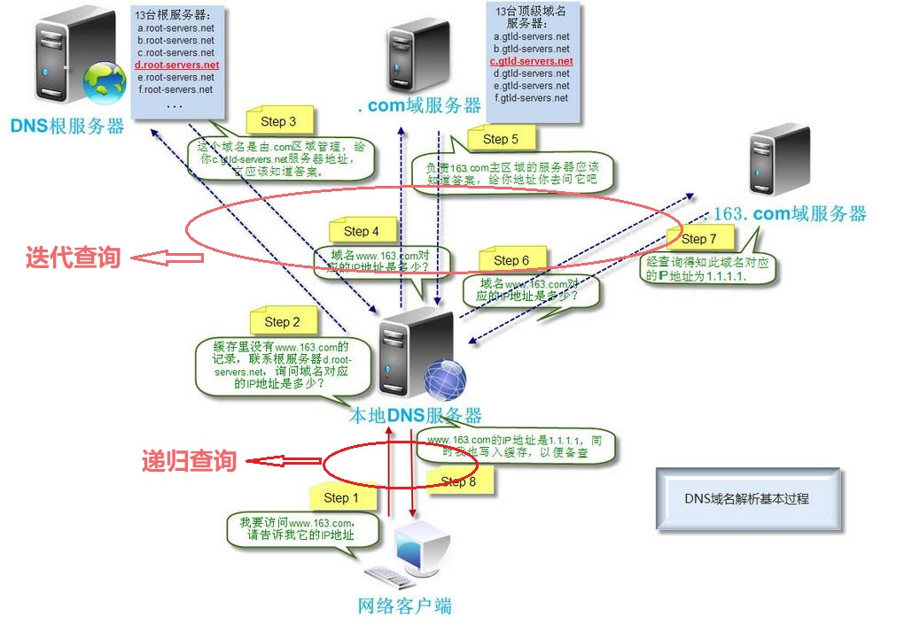
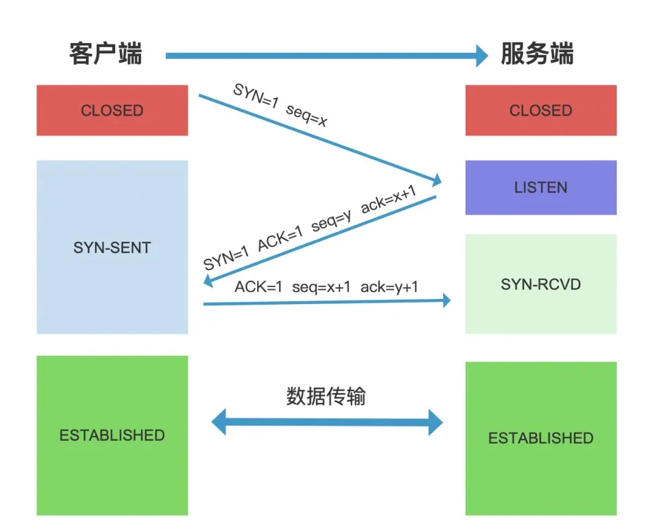
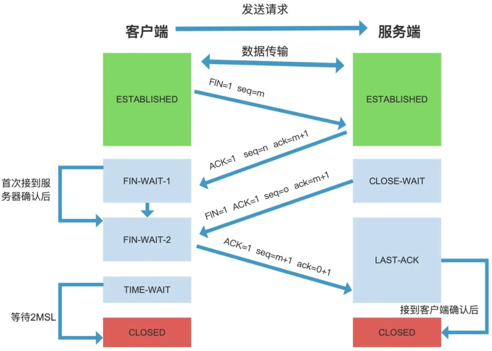

# 输入 url 到页面渲染经历什么
看了很多篇文章，发现大佬们开头总结的过程总是有个 1，2，3，4..7 8步，文章写得真好，但是开头总有种劝退我的感觉，看着害怕犯困。
所以我觉得这个问题大致上就和 `“把大象塞进冰箱”` 一样，也是三大步。
一是 处理 url，二 获取数据，三 浏览器渲染

哈哈哈是不是太简单了，下面我们仔细看看每一步都在搞些什么？

## 1.处理 url
### 1.1 未处理 url 之前
暂时先不说`从输入 url 到被浏览器接收`这部分的内容，这部分主要跟 输入输入硬件设备，CPU处理和操作系统内核有关。先说说跟浏览器，网络有关的部分

当用户输入关键字点击搜索之后，当前页面就将要被替换成新的页面，在替换新页面之前（拿到新页面数据，更换页面），浏览器还给了当前页面一次执行 `beforeunload` 事件的机会。`beforeunload` 事件允许当前页面不直接关闭，在这里可以触发提醒页面关闭的对话框和执行一些数据清理操作，也可以取消关闭或刷新。

### 1.2 浏览器接收 url
这部分的主要内容有关：浏览器进程/线程模型，JS的运行机制
> **进程是资源分配的最小单位，线程是 CPU 调度的最小单位**
简单的说，进程就像列火车，而线程就是车厢
线程必须依附于进程存在，一个进程可以有多个线程
<br>

##### 1.2.1 多进程的浏览器
浏览器是多进程的，有一个主控进程，然后每打开的 tab 页都会新开一个进程（有时会合并）
*谷歌浏览器设置里打开任务管理器，每个任务就是一个进程*

进程包括：
- 主控进程：浏览器的主进程（负责协调，主控），唯一的
- 插件进程：每种类型的插件对应一个进程，当使用该插件时才创建进程
- GPU 进程：最多一个，用于 3D 绘制
- 浏览器渲染进程：默认每个 Tab 页一个进程，互不影响。控制页面渲染，脚本执行，事件处理等（有时候会优化，如多个空白 tab 会合并成一个进程）

---

##### 1.2.2 多线程的浏览器内核
每个 tab 页都可看作一个浏览器内核进程，这个进程是 *多线程* 的。它有几大类子线程：
- GUI 线程
- JS 引擎线程 
- 事件触发线程
- 定时器线程
- 网络请求线程


JS 引擎是内核进程中的一个线程，这也是为什么常说 **JS 引擎是单线程的**
为什么是单线程可以点击看这里 [Click Here!!](http://www.ruanyifeng.com/blog/2014/10/event-loop.html)

---
##### 1.2.3 网络请求都是单独的线程
浏览器会根据解析得到的协议，开辟一个网络线程，前往请求资源。每次网络请求时都需要开辟单独的线程进行。

---
##### 1.2.4 更多
关于浏览器的进程机制,包括JS运行机制，进程线程的详解可以看这里
[从浏览器多进程到JS单线程，JS运行机制最全面的一次梳理](https://segmentfault.com/a/1190000012925872)

### 1.3 解析 url
##### 1.3.1 url 是什么
URL (Uniform Resource Locator) 统一资源定位符，俗称网址。遵守以下语法规则
```
scheme://host.domain:port/path/filename
```
- scheme : 因特网服务类型。常间的协议有 http,https,ftp,file,其中最常见的类型是 http，而 https 则是进行加密的网络传输

- host : 域主机（http 的默认主机是 www）

- domain : 因特网域名，例如 `xxx.com.cn`

- port : 主机上的端口号（http 默认端口号是 80）

- path : 服务器上的路径（如果省略，则文档必须位于网站的根目录中）

- filename : 文档/资源的名称
---
##### 1.3.2 域名解析
输入网址后，浏览器并不能直接通过网址找到对应的服务器进行通信，而是需要 `IP 地址` 

> **为什么有了网址又需要 IP 地址呢？**
> 因为 IP 地址是形如 `192.168.1.1` 这种的，方便计算机识别，但是对于人来说很难记。
为了方便人的使用习惯，就创造了域名。
> 
> **域名与 IP 地址的对应关系**
> - 一个域名只能找到一个唯一对应的 IP 地址。Internet上IP地址是唯一的，一个IP地址对应着唯一的一台主机。
> - 一个 IP 地址可以对应多个域名。一台计算机可以提供多个服务

**通过 DNS 解析获取 IP 地址**
DNS(domain name system) 上记录了一张域名与之对应的 IP 地址的表，类似电话簿。
解析的大致流程：
1. 先查看缓存，从[浏览器缓存](#1) 到本机系统缓存，到本机 host 文件（相当于一个本地小型 DNS 服务器）
2. 如果本地没有缓存，就会向 DNS 服务器查询。这中间如果架设了路由，路由可能也有缓存。
3. 先请求本地 DNS 服务器，一般都是你的网络接入服务器商提供，比如中国电信等。如果没有，本地 DNS 服务器还要向 DNS 根服务器进行查询。
4. 根 DNS 服务器不记录域名与 IP 地址的对应关系，而是返回对应的域服务器地址给本地 DNS 服务器，让其去访问查询。类似于此，通过迭代查询，本地 DNS 服务器获得解析的 IP 地址，缓存下来并放回给用户电脑。



**&#9733; DNS 解析是非常耗时的**
> 如果解析域名过多，会让首屏加载变的非常慢，这样用户体验就会很不好。
这里可以用 `dns-prefetch` 优化

<span id="1"></span>**在浏览器内核中查看缓存**
  > 浏览器和浏览器内核是不同的概念，浏览器指的是 Chrome, Firefox，而浏览器内核则是Blink,Genko
  > 浏览器内核只负责渲染，GUI和网络连接等跨平台工作则是由浏览器实现的

## 2. 获取数据
### 2.1 http 连接方面
浏览器获取 IP 地址，将 IP 地址打在协议上，并且搭载请求参数，然后一起发给对应的服务器。
服务器发送 http 请求，主要分三个部分：TCP 三次握手，http 请求，关闭 TCP 连接。（如果请求的协议是 https，那还需要建立 TLS 连接。）

##### 2.1.1 TCP 三次握手
目的：三次握手是为了连接服务器指定端口，建立 TCP 连接，并同步连接双方的序列号和确认号。
`SYN`: synchronous 同步序列编号
`seq`: Sequence number 序列号码
`ACK`: acknowledgement 确认连接
`ack`: Acknowledge number 确认号码
过程: 
- 1. 第一次握手
  客户端发送 `SYN = 1, Seq = x ` 至服务端，`SYN` = 1，表示告知服务器请求连接，并发送初始序列号 X
- 2. 第二次握手
  服务器返回 `SYN = 1, ACK = 1` 表示收到连接请求并确认准备连接，并发送自己的序号 `seq = y`，客户端确认序号 `ack = x + 1`
- 3. 第三次握手
  客户端发送 `ACK = 1` 确认连接，自己的序号 `seq = x + 1`，服务器的确认号 `ack = y + 1`。
  握手结束，连接成功。


**为什么需要三次握手？**
*防止已失效的连接请求报文段突然又传送到了服务端，因而产生错误*
- 一个失效请求传至服务端，服务端以为是新请求，便一直在等待客户端响应，造成服务器资源浪费。
- 握手三次是最少次数确认双方发送、接收能力都正常的方式，两次无法确定双方在发送、接收都正常，三次以上就是多此一举，浪费资源。

##### 2.1.2 http 请求
TCP 三次握手连接成功后，开始发送 http 请求报文。

##### 2.1.3 TCP 四次挥手

- 1. 客户端请求断开连接
- 2. 服务器确认客户端要断开请求，但是不能直接断开，可能还有事务处理
- 3. 服务器处理好当前所有事务，向客户端发起断开请求
- 4. 客户端确认服务器断开的请求

**为什么需要四次挥手？**
因为 TCP 是全双工通信的。（发送线和接收线独立的）
- 第一次挥手，客户端告诉服务器我不再发送数据包了，但是我还可以接收数据。
- 第二次挥手，服务器可能还要处理些数据，所以先发送 `ACK = 1` 告诉客户端我知道了。这样客户端收到了就不会一直重复第一次挥手
- 第三次挥手，服务器处理完事务，告诉客户端要断开连接了
- 第四次挥手，客户端收到断开，确认回复服务器。服务器释放资源

*以上每一步都有超时等待，超时就重新发送请求 

### 2.2 服务器处理请求并返回 http 报文


##### 参考文章
- [1](https://zhuanlan.zhihu.com/p/57895541)
- [2](https://zhuanlan.zhihu.com/p/34453198)
- [怎么理解TCP中的三次握手四次挥手](https://mp.weixin.qq.com/s?__biz=MzA4ODYyMDI3NA==&mid=2247484091&idx=1&sn=bd021869ec5db98281c08a1e6a7d8da2&chksm=90262f26a751a630c31e95c805f897bc2c01ded3924dc3cf5b820439d2c0daf133e05d617c48&scene=126&sessionid=1591754489&key=d140b998d465cbf4ddb5cd7bc5769924875a15b16f1bccbf86371f91c396f0b55154528b8ef103c406174bfe56f7afc3a31461f674a9b31f19348054d477bafa256c2719fbe12daaf2548524d0f68008&ascene=1&uin=MzYyNjI1Mzk1&devicetype=Windows+10+x64&version=62090070&lang=zh_CN&exportkey=AeNFC4E0tp%2FXaqR0T3B%2Fnh4%3D&pass_ticket=9iMUz3HFLUeZ9jp0m8lHzgldhxomWNP6brUlQo%2BInTXdyNtA%2Fb2nQAVn4N0j%2Ffnl)
